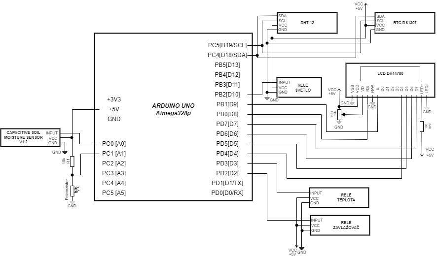

# Digital_electronic_2_project

##Scheme:

# YOUR_PROJECT_TITLE

### Team members

* David Sedláček (responsible for xxx)
* David Sladkowski (responsible for xxx)
* Marek Sedláček (responsible for xxx)
* Samuel Turák

Link to this file in your GitHub repository:

https://github.com/Samuelturak/Digital_electronic_2_project

### Table of contents

* [Project objectives](#objectives)
* [Hardware description](#hardware)
* [Libraries description](#libs)
* [Main application](#main)
* [Video](#video)
* [References](#references)

## Project objectives

The objective of this project was to create a greenhouse monitoring and control system.

## Hardware description

DHT12 sensor for air temperature measurement.

Fotoresistor GL5539 for luminance measurement.

Capacity soil moisture sensor 1.2. to measure soil humidity.

Relays to turn on ventilator, sprinkler system and lighting.

Real time clock DS 1307 for time tracking.

## Libraries description

Write your text here.

## Main application

Write your text here.

## Video

Write your text here

## References

1. Write your text here.