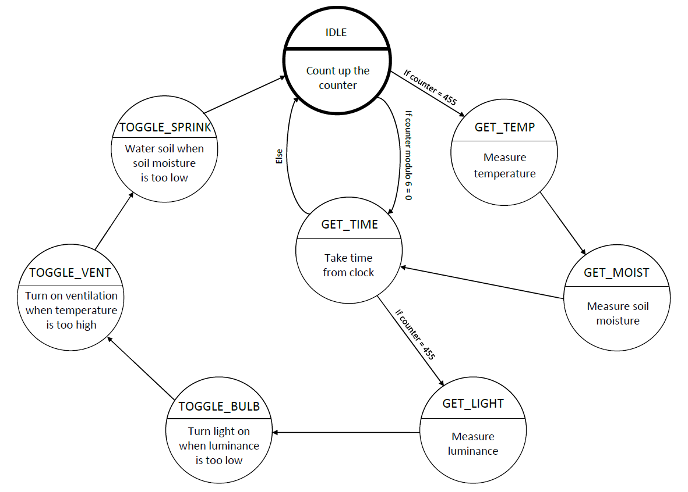

# Digital_electronic_2_project

# Greenhouse monitoring and control system

### Team members

* David Sedláček (responsible for programming)
* David Sladkowski `ID: 221043` (responsible for FSM visualisation, Documentation)
* Marek Sedláček `ID: 221068` (responsible for Scheme visualisation, Documentation)
* Samuel Turák `ID: 221059` (responsible for programming)

Link to this file in your GitHub repository:

https://github.com/Samuelturak/Digital_electronic_2_project

### Table of contents

* [Project objectives](#objectives)
* [Hardware description](#hardware)
* [Libraries description](#libs)
* [Main application](#main)
* [Video](#video)
* [References](#references)

## Project objectives

The objective of this project was to create a greenhouse monitoring and control system able to measure conditions inside a greenhouse such as temperature, soil moisture, luminance and to toggle ventilation, watering and lighting.

## Hardware description

* DHT12 sensor for air temperature measurement.

* Fotoresistor GL5539 for luminance measurement.

* Capacity soil moisture sensor 1.2. to measure soil humidity.

* Relays to turn on ventilator, sprinkler system and lighting.

* Real time clock DS 1307 for time tracking.

Every hardware part is described in the documentation folder in detail. 

## Libraries description

* GPIO library: Contains functions for controlling AVR's gpio pin's.
* LCD library: Basic routines for interfacing a HD44780U-based character LCD display. This library allows easy interfacing with a HD44780 compatible display.
* Uart library: This library is used to transmit and receive data through the built in UART.
* TWI library: This library defines functions for the TWI (I2C) communication between AVR and slave device's.
* Time library: This library contains macros for controlling the timer modules.

## Main application

### Scheme:

### Finite State Machine:

## Video

Write your text here

## References

* [DE2 laboratory](https://github.com/tomas-fryza/Digital-electronics-2/tree/master/Labs)
* [Arduino uno schematic](https://github.com/tomas-fryza/Digital-electronics-2/blob/master/Docs/arduino_shield.pdf)
